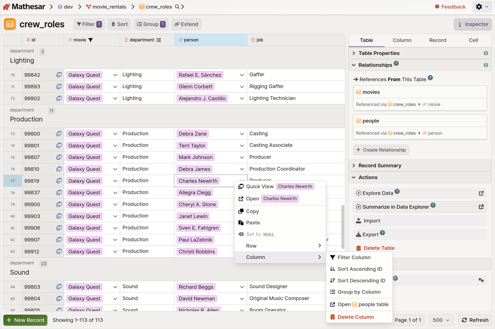
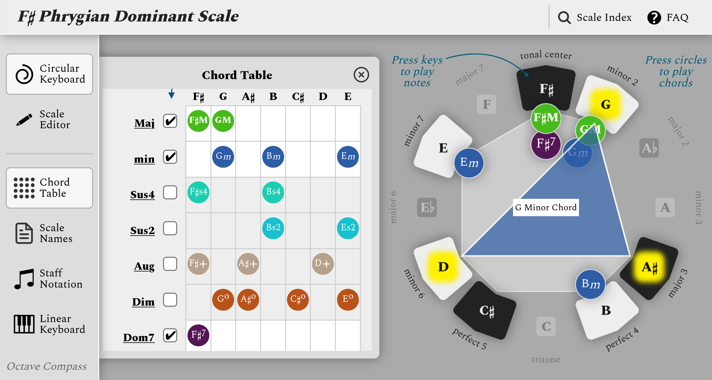
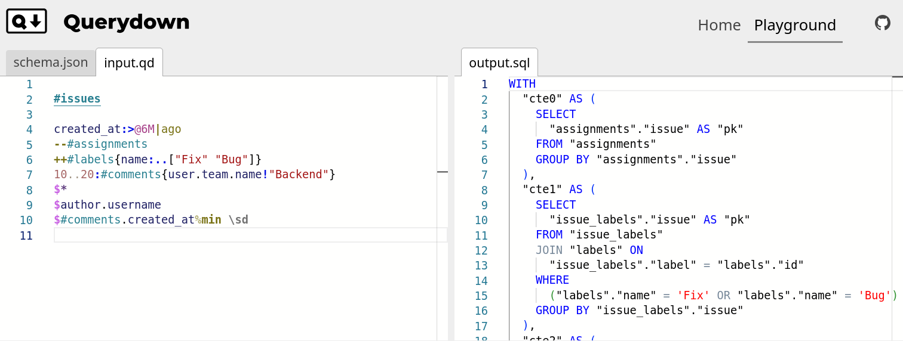

## About me

I'm a software engineer who works across the web stack with a focus on front end.

**[Resume](https://github.com/seancolsen/resume/blob/main/Sean_Colsen_Resume.pdf)** / **[LinkedIn](https://linkedin.com/in/sean-colsen)** / **[Email](mailto:colsen.sean@gmail.com)**

## A few things I've built

- **Mathesar** — [repo](https://github.com/mathesar-foundation/mathesar) / [org site](https://mathesar.org/) &nbsp; &nbsp; <kbd>Svelte</kbd> <kbd>TypeScript</kbd> <kbd>Python</kbd> <kbd>PL/pgSQL</kbd>

    In collaboration with a small team of other engineers, I've spent several years as a full-time paid maintainer of this open source spreadsheet-like interface for PostgreSQL databases.

    

- **Octave Compass** — [repo](https://github.com/seancolsen/octave-compass) / [live app](https://octavecompass.com/)  &nbsp; &nbsp; <kbd>Svelte</kbd> <kbd>TypeScript</kbd>

    This hobby project of mine is a tool for exploring musical scales and the chords that they contain.

    

- **Querydown** — [repo](https://github.com/seancolsen/querydown) / [live playground](https://querydown.org/playground) / [docs]() &nbsp; &nbsp; <kbd>Rust</kbd>

    This is an nascent hobby project of mine to create a DSL for writing relational database queries that compile to SQL.

    
